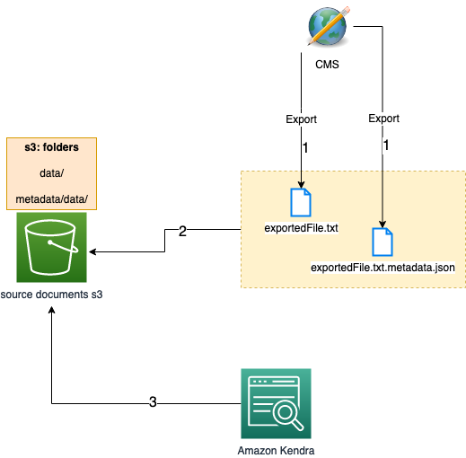

# Amazon S3 document metadata

## Concepts

Reference : https://docs.aws.amazon.com/kendra/latest/dg/s3-metadata.html

When the source of your data is an Amazon S3 bucket or an Amazon S3 data source, you can apply custom attributes to your documents using metadata files. You can add metadata, additional information about a document, to documents in an Amazon S3 bucket using a metadata file. Each metadata file is associated with an indexed document. 

Your document metadata is defined in a JSON file. The file must be a UTF-8 text file without a BOM marker. The file name of the JSON file should be document.extension.metadata.json, where "document" is the name of the document that the metadata applies to and "extension" is the file extension for the document.

The content of the JSON file follows this template. All of the attributes are optional. If you don't specify the _source_uri, then the links returned by Amazon Kendra in search results point to the Amazon S3 bucket that contains the document. 

###### Below is an example from the developer documentations mentioned above

```
{
    "DocumentId": "document ID",
    "Attributes": {
        "_category": "document category",
        "_created_at": "ISO 8601 encoded string",
        "_last_updated_at": "ISO 8601 encoded string",
        "_source_uri": "document URI",
        "_version": "file version",
        "_view_count": number of times document has been viewed,
        "custom attribute key": "custom attribute value",
        additional custom attributes
    },
    "AccessControlList": [
         {
             "Name": "user name",
             "Type": "GROUP | USER",
             "Access": "ALLOW | DENY"
         }
    ],
    "Title": "document title",
    "ContentType": "HTML | MS_WORD | PDF | PLAIN_TEXT | PPT"
}


```

- You can add additional information to the Attributes field about a document that you use to filter queries or to group query responses. For more information, see Creating custom document attributes of Amazon Kendra's dev document.
- The AccessControlList field enables you to filter the response from a query so that only certain users and groups have access to documents. For more information, see Filtering on user context of Amazon Kendra's dev document.

## Background

You may have a situation where there is an existing CMS or content which you would like to export out in JSON and index it in Kendra. You can add metadata, additional information about a document, to documents in an Amazon S3 bucket using a metadata file. Each metadata file is associated with an indexed document. 

In this demo, we will export two files from a webpage with our sample code

* Document with primary text/blob which you want to index 
* Associated metadata, additional information about a document


example

- quarantine-isolation.txt --> This will have main text (example *description*  which you want to index
- quarantine-isolation.txt.metadata.json --> This will have the meta data attributes which you want to export and associate with your document. 


```
{
    "DocumentId": "2",
    "Attributes": {
        "documentID": "2",
        "title": "Quarantine & Isolation",
        "description": "Quarantine after possible exposure to COVID-19 and stay home to monitor your health. Isolate when you have been infected with the virus and stay separated from others in your household.",
        "url": "https://www.cdc.gov/coronavirus/2019-ncov/your-health/quarantine-isolation.html",
        "_source_uri": "https://www.cdc.gov/coronavirus/2019-ncov/your-health/quarantine-isolation.html",
        "site_name": "Centers for Disease Control and Prevention",
        "image": "https://www.cdc.gov/coronavirus/2019-ncov/images/your-health/328871-quarantine-and-isolation-guidance-1200x675-1.jpg?_=31337",
        "icon": "/TemplatePackage/4.0/assets/imgs/favicon-32x32.png",
        "keywords": "quarantine, isolation, isolate, COVID-19, exposure, prevent spread, stay home, separate, monitor health, Coronavirus [CoV], Prevention & Infection Control, Distancing"
    },
    "Title": "Quarantine & Isolation",
    "ContentType": "PLAIN_TEXT"
}

```

## Architecture

We will be implementing below architecture for our demo. 




Step 1 : Export your web pages into following files 

- quarantine-isolation.txt --> This will have main text (example description which you want to index
- quarantine-isolation.txt.metadata.json --> This will have the meta data attributes which you want to export and associate with your document.

Step 2 : Create following folders in your sample S3 bucket and upload the files as directed below

- data/ : This will have main text (example description which you want to index e.g. quarantine-isolation.txt
- metadata/data/ : This will have the meta data attributes which you want to export and associate with your document. e.g. quarantine-isolation.txt.metadata.json

Step 3 : Do the following in Amazon Kendra 

* Create Kendra index. Reference : [Creating an Index](https://docs.aws.amazon.com/kendra/latest/dg/create-index.html)
* Create Datasource using S3 bucket as source and pointing to data and metadata folders. Reference : [Getting started with an Amazon S3 data source (console)](https://docs.aws.amazon.com/kendra/latest/dg/getting-started-s3.html) 
* Use the console or the [UpdateIndex API](https://docs.aws.amazon.com/kendra/latest/dg/API_UpdateIndex.html) to create the index fields. The supported field types are date, long, string, and string list. Reference : [Creating custom document attributes](https://docs.aws.amazon.com/kendra/latest/dg/custom-attributes.html)

Once all the steps are done and verified, you can search your content. 


